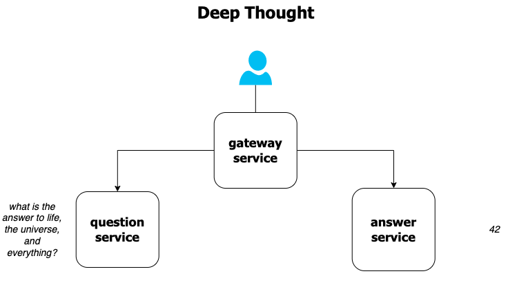
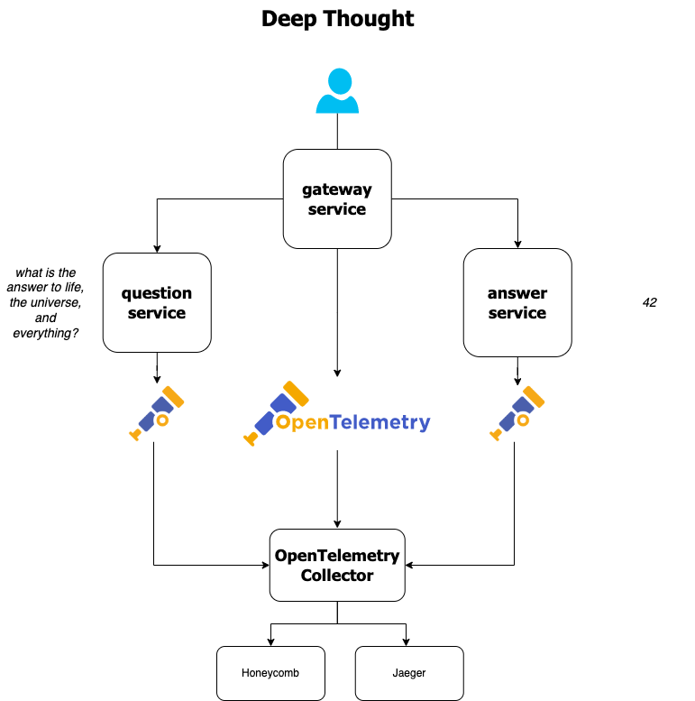
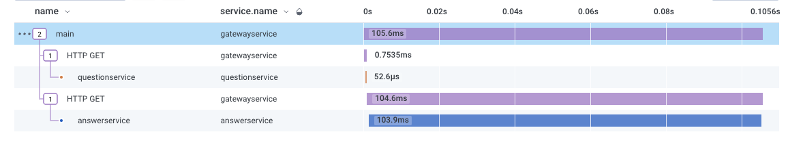
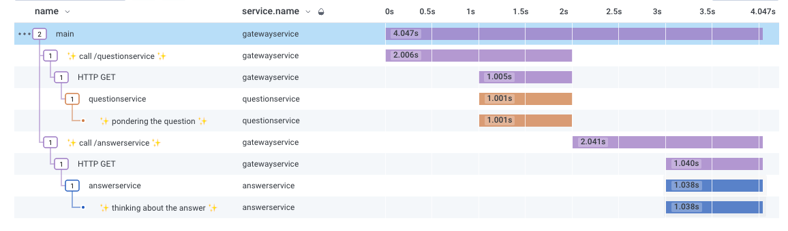

# deep-thought

## regular ol' app



`cd 0-deep-thought-uninstrumented/`

`docker-compose up --build`

```bash
$ curl localhost:4242
what is the answer to the ultimate question of life, the universe, and everything?
42
```

## instrumented app, with instrumentation for http requests



`cd 1-deep-thought-instrumented/`

`export HONEYCOMB_API_KEY=<api-key>`

`docker-compose up --build`

```bash
$ curl localhost:4242
what is the answer to the ultimate question of life, the universe, and everything?
42
```



## instrumented app with auto and manual instrumentation

`cd 2-deep-thought-instrumented-manual/`

`export HONEYCOMB_API_KEY=<api-key>`

`docker-compose up --build`

```bash
$ curl localhost:4242
what is the answer to the ultimate question of life, the universe, and everything?
42
```


